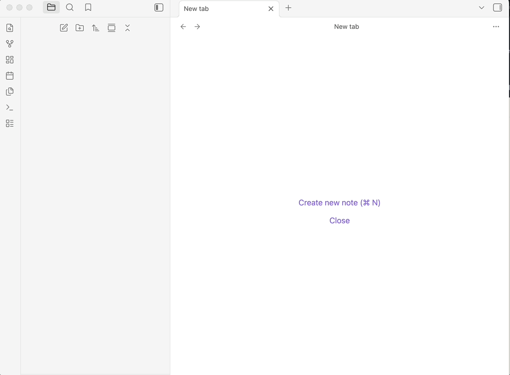

# Daily Link

Obsidian plugin that automatically links every newly created note to the day's daily note, weaving temporal connections into your graph without manual upkeep.



## How it works

When you create a note, Daily Link finds (or creates) today's daily note and upserts a wiki link in a configurable frontmatter property:

```yaml
---
notes:
  - "[[my new note]]"
  - "[[another note from today]]"
---
```

Renames are handled by Obsidian's native link tracking — no separate bookkeeping.

## Install

**Community catalog** (once approved): Settings → Community plugins → Browse → search "Daily Link".

**Beta via BRAT**: install [BRAT](https://github.com/TfTHacker/obsidian42-brat), then add `nhomble/obsidian-daily-link`.

## Settings

| Setting | Default | Description |
| --- | --- | --- |
| Frontmatter property | `notes` | Key to upsert links into. |
| Allowed extensions | `md` | File extensions that trigger linking. |
| Excluded folders | _(none)_ | Folder paths whose new files are ignored. |
| Create daily note if missing | on | Create today's daily (using your template) if absent. |

## Requirements

The core **Daily Notes** plugin must be enabled.

## License

MIT
